```mermaid
graph LR
    A[Python Basics] --> B[Git & GitHub]
    B --> C[Linux & Shell Scripting]
    C --> D[Docker & Containers]
    D --> E[Kubernetes]
    E --> F[Cloud Platforms]
    F --> G[CI/CD Pipelines]
    G --> H[Infrastructure as Code]
    H --> I[Monitoring & Logging]
    I --> J[DevOps Engineer]
    
    style A fill:#4CAF50
    style B fill:#4CAF50
    style C fill:#4CAF50
    style D fill:#2196F3
    style E fill:#2196F3
    style F fill:#FF9800
    style G fill:#FF9800
    style H fill:#9E9E9E
    style I fill:#9E9E9E
    style J fill:#F44336
```

<div align="center">

<!-- Typing SVG Animation -->
<a href="https://git.io/typing-svg"></a>

---

<!-- Wave Animation Header -->


</div>

---

## 💫 About Me


### 🎯 What I'm Up To

- 🔭 Building **CLI tools** and **automation scripts** with Python
- 🌱 Deep diving into **DevOps practices** and **Cloud technologies**
- 📚 Creating comprehensive **technical documentation** and guides
- 🤝 Open to **collaborations** on DevOps and Python projects
- 💬 Ask me about: **Python, Linux, Git, Docker, CI/CD**
- 📝 Writing technical content on **GitHub** and sharing on **social media**

---

## 🌐 Connect With Me

<div align="center">

[](https://linkedin.com/in/anurag-banerjee-a8299a37a)
[](https://github.com/abydow)

</div>

<div align="center">


[](https://github.com/abydow?tab=followers)

</div>

---

## 🛠️ Tech Stack & Tools

### ☁️ Cloud & DevOps

<p align="center">
  
</p>

<p align="center">
  
  
  
  
  
  
</p>

### 💻 Programming & Scripting

<p align="center">
  
</p>

<p align="center">
  
  
  
  
  
</p>

### 🐧 Operating Systems & Tools

<p align="center">
  
</p>

<p align="center">
  
  
  
  
  
</p>

### 🔧 CI/CD & Automation

<p align="center">
  
</p>

<p align="center">
  
  
  
</p>

---

## 📊 GitHub Statistics

<div align="center">

<!-- GitHub Stats Card -->


<!-- Top Languages Card -->


</div>

<div align="center">

<!-- Contribution Streak -->


</div>

<div align="center">

<!-- GitHub Activity Graph -->


</div>

<div align="center">

<!-- GitHub Trophy -->


</div>

---

## 🚀 Featured Projects

<div align="center">

<!-- Project Cards -->
<a href="https://github.com/abydow/Manual-Arch-Linux-Installation">
  
</a>

<a href="https://github.com/abydow/Python">
  
</a>

</div>

### 💡 Project Highlights

| Project | Description | Tech Stack | Status |
|---------|-------------|------------|--------|
| **📦 Manual Arch Linux Installation** | Complete guide for manual Arch Linux installation with full system control | Arch Linux, Bash, System Administration | ✅ Active |
| **🐍 Python Learning Repository** | Comprehensive Python notes and projects - from basics to advanced concepts | Python, Markdown, Git | 🔄 In Progress |
| **🚀 GitHub Activity CLI** | CLI tool to track and display GitHub user activity | Python, GitHub API | ✅ Complete |
| **⚙️ DevOps Automation Scripts** | Collection of automation scripts for DevOps workflows | Python, Bash, Docker | 🔄 In Progress |

---

## 📝 Latest Blog Posts & Content

<!-- BLOG-POST-LIST:START -->
<!-- This section auto-updates with your latest blog posts using GitHub Actions -->
- 🚀 **Getting Started with Kubernetes**: A beginner's guide
- ☁️ **AWS vs Azure vs GCP**: Choosing your cloud platform
- 🐍 **Python for DevOps**: Essential libraries and tools
- 🐳 **Docker Best Practices**: Container optimization tips
<!-- BLOG-POST-LIST:END -->

➡️ [**Read more on my blog →**](https://yourblog.com)

---

## 🎓 Certifications & Achievements

<div align="center">

| Certification | Status | Date |
|---------------|--------|------|
| 🏆 **AWS Certified Cloud Practitioner** | 🎯 In Progress | 2025 |
| 🏆 **Docker Certified Associate** | 🎯 Planned | 2025 |
| 🏆 **Kubernetes Administrator (CKA)** | 🎯 Planned | 2025 |
| 🏆 **GitHub Actions Certification** | 🎯 Planned | 2025 |

</div>

---

## 📈 Contribution Graph

<div align="center">

<!-- Contribution Snake Animation -->


</div>

---

## 💼 Experience & Education

### 🎯 Focus Areas

- **DevOps Engineering**: CI/CD pipelines, automation, infrastructure as code
- **Cloud Computing**: AWS, Azure, multi-cloud architecture
- **System Administration**: Linux server management, performance optimization
- **Python Development**: CLI tools, automation scripts, API development
- **Technical Documentation**: Creating comprehensive guides and tutorials

### 📚 Education

- **12th Grade** - West Bengal Board (4th Semester)
- **Next**: Considering **BCA (Bachelor of Computer Applications)**

---

## 🤝 Open Source Contributions

<div align="center">

<!-- Contribution Metrics -->


</div>

### 🌟 Contribution Highlights

- 📝 **Documentation Improvements**: Contributing to open-source documentation
- 🐛 **Bug Fixes**: Resolving issues in community projects
- ✨ **Feature Additions**: Adding new features to existing projects
- 💬 **Community Support**: Helping others in discussions and forums

---

## 🎯 Current Learning Path



---

## 🎮 When I'm Not Coding

- 🎮 **Gaming**: Pokemon, Genshin Impact, Call of Duty Mobile, Sekiro, Elden Ring
- 💪 **Fitness**: Gym workouts and bodybuilding
- 🎨 **Content Creation**: Technical YouTube content and social media
- 📺 **Anime**: Currently watching and rewatching classics
- 🖥️ **Linux Ricing**: Customizing my Arch Linux setup with Hyperland

---

## 💡 Fun Stats

<div align="center">

```text
🌟 Total Stars Earned:     XX
🔀 Total Forks:            XX
📝 Total Commits (2025):   XXX+
🔥 Current Streak:         X days
👥 Followers:              5
📦 Public Repositories:    2
🎯 Most Used Language:     Python
```

</div>

---

## 🏆 GitHub Achievements

<div align="center">

<!-- Replace with your actual achievement badges -->


</div>

---

<div align="center">

### 🌟 If you like my work, consider giving it a star! ⭐
> **"The best way to predict the future is to create it."** - Peter Drucker
### 💙 Thank you for visiting my profile!


</div>
